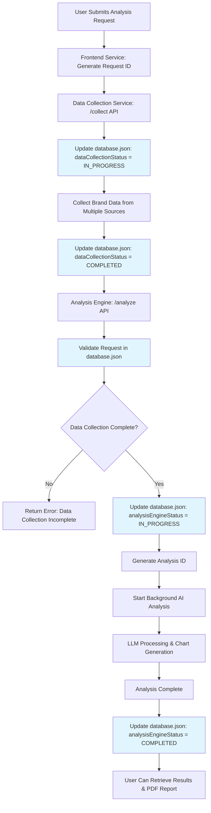

# Analysis Engine Service

A comprehensive brand analysis service with LLM provider toggle support for competitive intelligence and actionable insights.

## 🚀 Features

- **Dynamic Data Processing**: Analyze any unstructured JSON data from collect_id files
- **Async Processing**: True asynchronous LLM calls with immediate endpoint responses
- **LLM Provider Toggle**: Switch between OpenAI and Together.ai
- **Comprehensive Analysis**: Brand analysis with competitor insights and scoring
- **Chart Generation**: 8+ chart types for UI visualization (bar, radar, line, pie, doughnut, etc.)
- **PDF Report Generation**: Base64-encoded reports with optional local file saving
- **Request ID Tracking**: Custom request tracking via headers with auto-generation fallback
- **Competitor Analysis**: Detailed competitor insights with strengths/weaknesses/opportunities
- **Improvement Areas**: Actionable recommendations with priorities, timelines, and resources
- **Real-time Status**: Track analysis progress with comprehensive status endpoints
- **Configurable Paths**: Customizable data collection and report storage directories
- **Health Monitoring**: Service health and LLM connectivity checks

## ⚡ Async Performance

### True Asynchronous Processing
- **Immediate Response**: `/analyze` endpoint returns instantly with `analysis_id`
- **Background Processing**: LLM analysis runs in async background tasks
- **Non-blocking**: Multiple analysis requests can be processed concurrently
- **Async HTTP**: Uses `aiohttp` for non-blocking LLM API calls
- **Thread Pool**: OpenAI calls run in executor thread pools for async operation

### Performance Benefits
- **Fast Response Times**: < 100ms endpoint response regardless of analysis complexity
- **Concurrent Processing**: Multiple analyses can run simultaneously
- **Resource Efficiency**: Non-blocking I/O operations reduce server resource usage
- **Scalability**: Can handle high request volumes without blocking

## 📊 Chart Types & Analysis Features

### Generated Chart Types
The analysis engine generates 8+ chart types for comprehensive data visualization:

1. **Bar Chart** - Overall Performance Comparison
2. **Radar Chart** - Category Performance Analysis
3. **Line Chart** - Performance Trend Analysis
4. **Pie Chart** - Market Share Distribution
5. **Doughnut Chart** - News Sentiment Distribution
6. **Area Chart** - Social Media Performance
7. **Scatter Plot** - Competitive Positioning
8. **Gap Analysis Chart** - Improvement Opportunities

### Analysis Components
- **Competitor Insights:** Strengths, weaknesses, opportunities, key differences
- **Improvement Areas:** Priority recommendations, action plans, timelines, resources, expected outcomes
- **Market Positioning:** Brand/competitor positioning, target audience, differentiation

### PDF Report Features
- **Executive Summary:** Overall scores, KPIs, recommendations
- **Detailed Analysis:** Category breakdown, comparison matrix, trends
- **Visual Data:** All generated charts, tables, benchmarks
- **Appendix:** Data sources, methodology, collection metadata

## �️ Database Integration

### Shared Status Tracking

The analysis engine integrates with a shared `database.json` file to track request status across microservices. This enables coordinated processing and proper error handling.

### Process Flow



### Database.json Structure
```json
[
    {
        "requestId": "UUID generated by UI",
        "brandId": "brand name",
        "dataCollectionId": "unique id generated by data-collection /collect api",
        "dataCollectionStatus": "IN_PROGRESS/COMPLETED",
        "analysisEngineId": "unique id generated by analysis-engine /analyze api",
        "analysisEngineStatus": "IN_PROGRESS/COMPLETED/FAILED",
        "lastUpdated": "2025-07-30T23:08:20.875528+00:00"
    }
]
```

### Integration Points

1. **Request Validation**: `/analyze` endpoint validates that a matching record exists in database.json
2. **Status Checking**: Ensures `dataCollectionStatus` is "COMPLETED" before proceeding
3. **Progress Tracking**: Updates `analysisEngineStatus` to "IN_PROGRESS" when analysis starts
4. **Completion Handling**: Updates status to "COMPLETED" or "FAILED" when background processing finishes
5. **Error Recovery**: Provides clear status tracking for debugging and failure recovery

### Database Configuration

| Variable | Description | Default |
|----------|-------------|---------|
| `DATABASE_JSON_PATH` | Path to shared database.json file | `../shared/database.json` |

**Path Support**: Both relative and absolute paths are fully supported.

**Examples**:
```bash
# Relative path (default)
DATABASE_JSON_PATH=../shared/database.json

# Absolute paths
DATABASE_JSON_PATH=C:/data/brand_analysis/shared/database.json          # Windows
DATABASE_JSON_PATH=/opt/brand_analysis/shared/database.json             # Linux/Mac
DATABASE_JSON_PATH=D:\\projects\\brand_system\\shared\\database.json    # Windows with backslashes
```

## �🔧 LLM Provider Configuration

### Supported Providers

1. **OpenAI GPT-4** (Default)
   - High-quality analysis with proven reliability
   - Requires OpenAI API key

2. **Together.ai Llama-3.3-70B** 
   - Cost-effective alternative with excellent performance
   - Requires Together.ai API key

### Switching Providers

Edit the `.env` file to change the LLM provider:

```bash
# For OpenAI (default)
LLM_PROVIDER=openai
OPENAI_API_KEY=your_openai_api_key_here
OPENAI_MODEL=gpt-4

# For Together.ai
LLM_PROVIDER=together
TOGETHER_API_KEY=your_together_api_key_here
TOGETHER_MODEL=meta-llama/Llama-3.3-70B-Instruct-Turbo-Free
```

### Environment Variables

| Variable | Description | Default |
|----------|-------------|---------|
| `LLM_PROVIDER` | Choose `openai` or `together` | `openai` |
| `OPENAI_API_KEY` | OpenAI API key | - |
| `OPENAI_MODEL` | OpenAI model name | `gpt-4` |
| `TOGETHER_API_KEY` | Together.ai API key | - |
| `TOGETHER_MODEL` | Together.ai model name | `meta-llama/Llama-3.3-70B-Instruct-Turbo-Free` |
| `SERVICE_PORT` | Port for the analysis service | `8003` |
| `LOG_LEVEL` | Logging level | `INFO` |
| `SSL_VERIFY` | SSL certificate verification | `true` |
| `SAVE_REPORTS_LOCALLY` | Enable local PDF file saving | `true` |
| `REPORTS_DIRECTORY` | Directory for saving PDF reports | `./reports` |
| `DATA_COLLECTION_PATH` | Path to collected data JSON files | `../data-collection/data/collected_data` |
| `DATABASE_JSON_PATH` | Path to shared database.json file | `../shared/database.json` |

**📁 Path Configuration Notes:**
- **Absolute paths** are fully supported for all file/directory paths
- **Relative paths** work relative to the analysis-engine directory
- **Automatic creation**: Directories are created automatically if they don't exist
- **Cross-platform**: Works on Windows, Linux, and Mac with proper path formatting

## 📦 Installation

1. **Navigate to the analysis-engine directory:**
   ```bash
   cd analysis-engine
   ```

2. **Install dependencies:**
   ```bash
   pip install -r requirements.txt
   ```

3. **Configure environment:**
   ```bash
   cp .env.example .env
   # Edit .env with your API keys and preferred LLM provider
   ```

## 🏃‍♂️ Quick Start

### Option 1: Direct Start (Recommended)
```bash
uvicorn app.main:app --reload --host 0.0.0.0 --port 8003
```

### Option 2: Python Module Mode
```bash
python -m uvicorn app.main:app --reload --host 0.0.0.0 --port 8003
```

### Option 3: Production Mode
```bash
uvicorn app.main:app --host 0.0.0.0 --port 8003 --workers 4
```

## 📊 API Endpoints

### 1. Start Analysis
**POST** `/api/v1/analyze`

Start a new brand analysis using collected data from a specified collect_id.

**Headers:**
- `request_id` (optional): Custom request identifier for tracking. If not provided, will auto-generate one (format: `req_{8_digit_uuid}`)
- `Content-Type`: `application/json`

**Request Body:**
```json
{
  "collect_id": "collect_0ed18553",
  "analysis_focus": "comprehensive",
  "comparison_brand": "Apple"
}
```

**Request Parameters:**
- `collect_id` (string, required): Collection ID matching the filename in the configured data collection directory
- `analysis_focus` (string, optional): Focus area for analysis. Default: "comprehensive"
- `comparison_brand` (string, optional): Optional competitor brand for comparison

**Success Response (200):**
```json
{
  "success": true,
  "analysis_id": "analysis_custom-req-123_161545",
  "status": "processing",
  "estimated_duration": 60
}
```

**Note:** The `analysis_id` format includes the request_id and timestamp for easy tracking, while collect_id is stored separately in the analysis metadata.

**Error Response (404) - Data Not Found:**
```json
{
  "success": false,
  "error": {
    "code": "DATA_NOT_FOUND",
    "message": "Collected data file not found for collect_id: collect_0ed18553",
    "details": {
      "field": "collect_id",
      "value": "collect_0ed18553"
    }
  },
  "timestamp": "2025-07-30T19:12:57Z"
}
```

**Error Response (400) - Validation Error:**
```json
{
  "success": false,
  "error": {
    "code": "VALIDATION_ERROR",
    "message": "collect_id is required",
    "details": {
      "field": "collect_id",
      "value": ""
    }
  },
  "timestamp": "2025-07-30T19:12:57Z"
}
```

---

### 2. Check Analysis Status
**GET** `/api/v1/analyze/{analysis_id}/status`

Get the current status and progress of an analysis with comprehensive chart data and insights when completed.

**Path Parameters:**
- `analysis_id` (string): The unique identifier of the analysis

**Success Response - Processing (200):**
```json
{
  "success": true,
  "data": {
    "analysis_id": "analysis_custom-req-123_161545",
    "status": "processing",
    "progress": 45,
    "current_step": "Generating chart data",
    "estimated_completion": "2025-07-30T19:35:00Z"
  },
  "charts": null,
  "competitor_analysis": null,
  "improvement_areas": null
}
```

**Success Response - Completed (200):**
```json
{
  "success": true,
  "data": {
    "analysis_id": "analysis_custom-req-123_161545",
    "status": "completed",
    "progress": 100,
    "completed_at": "2025-07-30T19:30:00Z",
    "analysis_result": {
      "analysis_id": "analysis_6c65f06e",
      "area_id": "comprehensive",
      "brand_name": "Google",
      "competitor_name": "comprehensive",
      "overall_comparison": {
        "brand_score": 0.72,
        "competitor_score": 0.518,
        "gap": 0.202,
        "brand_ranking": "leading",
        "confidence_level": 0.85
      }
    }
  },
  "charts": [
    {
      "chart_type": "bar",
      "title": "Overall Performance Comparison",
      "description": "Brand vs Competitor overall performance scores",
      "data": {
        "labels": ["Brand Score", "Competitor Score"],
        "datasets": [
          {
            "label": "Performance Scores",
            "data": [0.72, 0.518],
            "backgroundColor": ["#4CAF50", "#FF6B6B"]
          }
        ]
      },
      "config": {
        "responsive": true,
        "plugins": {
          "legend": {"display": true},
          "title": {"display": true, "text": "Overall Performance Comparison"}
        }
      }
    },
    {
      "chart_type": "radar",
      "title": "Category Performance Analysis",
      "description": "Performance comparison across different business categories",
      "data": {
        "labels": ["News Sentiment", "Social Media", "Customer Satisfaction"],
        "datasets": [
          {
            "label": "Brand Performance",
            "data": [0.72, 0.65, 0.78],
            "borderColor": "#4CAF50",
            "backgroundColor": "rgba(76, 175, 80, 0.2)"
          },
          {
            "label": "Competitor Performance", 
            "data": [0.518, 0.45, 0.62],
            "borderColor": "#FF6B6B",
            "backgroundColor": "rgba(255, 107, 107, 0.2)"
          }
        ]
      },
      "config": {
        "responsive": true,
        "scales": {
          "r": {
            "beginAtZero": true,
            "max": 1
          }
        }
      }
    }
  ],
  "competitor_analysis": [
    {
      "competitor_name": "comprehensive",
      "comparison_score": 0.518,
      "strengths": [
        "Strong news_sentiment performance",
        "Large social media following"
      ],
      "weaknesses": [
        "Weaker social_media compared to us",
        "Limited market penetration in specific segments"
      ],
      "opportunities": [
        "Focus on areas where competitor is weak",
        "Leverage our brand strengths more effectively"
      ],
      "key_differences": [
        "Market positioning: Modern tech-focused approach vs Traditional comprehensive strategy",
        "Significantly stronger in social_media"
      ]
    }
  ],
  "improvement_areas": [
    {
      "area": "News Sentiment",
      "current_score": 0.72,
      "target_score": 0.85,
      "priority": "medium",
      "description": "Performance gap identified in news_sentiment requiring strategic improvement",
      "action_items": [
        "Conduct a detailed audit of the news sentiment strategy.",
        "Gather customer feedback specifically for news sentiment.",
        "Benchmark against top competitors in news sentiment."
      ],
      "expected_outcomes": [
        "Improve news sentiment score by 15-25%",
        "Increase customer satisfaction",
        "Enhance brand reputation"
      ],
      "timeline": "3-6 months",
      "resources_needed": [
        "PR team",
        "Media budget", 
        "Content creators"
      ]
    }
  ]
}
```

---

### 3. Get Analysis Results
**GET** `/api/v1/analyze/{analysis_id}/results`

Retrieve the complete results of a finished analysis.

**Path Parameters:**
- `analysis_id` (string): The unique identifier of the analysis

**Success Response (200):**
```json
{
  "success": true,
  "data": {
    "analysis_id": "analysis_12345678",
    "area_id": "self_service_portal",
    "brand_name": "Oriental Bank PR",
    "competitor_name": "Banco Popular",
    "overall_comparison": {
      "brand_score": 0.76,
      "competitor_score": 0.84,
      "gap": -0.08,
      "brand_ranking": "second",
      "confidence_level": 0.92
    },
    "detailed_comparison": {
      "user_experience": {
        "brand_score": 0.82,
        "competitor_score": 0.89,
        "difference": -0.07,
        "insight": "Competitor has superior UI/UX design and mobile optimization",
        "trend": "improving"
      },
      "customer_satisfaction": {
        "brand_score": 0.75,
        "competitor_score": 0.81,
        "difference": -0.06,
        "insight": "Higher employee satisfaction correlates with better customer service",
        "trend": "stable"
      }
    },
    "actionable_insights": [
      {
        "priority": "high",
        "category": "Technology",
        "title": "Implement Advanced Mobile Banking Features",
        "description": "Enhance mobile app with biometric authentication and advanced financial tools",
        "estimated_effort": "3-6 months",
        "expected_impact": "Increase UX score by 0.15 points",
        "roi_estimate": "15-25% improvement in customer satisfaction",
        "implementation_steps": [
          "Conduct UX audit of current mobile app",
          "Research competitor mobile features",
          "Develop biometric authentication system",
          "Implement advanced financial planning tools",
          "Conduct user testing and feedback collection"
        ],
        "success_metrics": [
          "Mobile app rating >4.5 stars",
          "15% increase in mobile engagement",
          "Reduced customer support tickets"
        ]
      }
    ],
    "strengths_to_maintain": [
      {
        "area": "Brand Trust",
        "description": "Strong local market presence and customer loyalty",
        "recommendation": "Continue community engagement and local sponsorships",
        "current_score": 0.88
      }
    ],
    "market_positioning": {
      "brand_position": "Local community-focused bank with traditional values",
      "competitor_position": "Technology-forward regional bank with modern services",
      "differentiation_opportunity": "Combine traditional trust with modern technology",
      "target_audience": "Local professionals and small businesses"
    },
    "trend_analysis": {
      "brand_trend": "Gradual digital transformation needed",
      "competitor_trend": "Strong digital innovation momentum",
      "market_trend": "Increasing demand for digital banking solutions",
      "recommendations": [
        "Accelerate digital transformation initiatives",
        "Invest in mobile-first customer experience",
        "Maintain competitive advantage in personal service"
      ]
    },
    "confidence_score": 0.89,
    "created_at": "2025-07-28T21:00:00Z",
    "completed_at": "2025-07-28T21:30:00Z"
  }
}
```

**Error Response (404):**
```json
{
  "success": false,
  "error": {
    "code": "NOT_FOUND",
    "message": "Analysis not found",
    "details": {
      "field": "analysis_id",
      "value": "analysis_12345678"
    }
  },
  "timestamp": "2025-07-30T19:00:00Z"
}
```

**Error Response (202) - Still Processing:**
```json
{
  "success": false,
  "error": {
    "code": "ANALYSIS_IN_PROGRESS",
    "message": "Analysis is still in progress",
    "details": {
      "field": "analysis_id",
      "value": "analysis_12345678"
    }
  },
  "timestamp": "2025-07-30T19:00:00Z"
}
```

---

### 4. Generate PDF Report
**GET** `/api/v1/analyze/{analysis_id}/report`

Generate a comprehensive PDF report of the analysis and return as base64-encoded string. If configured, also saves the PDF file locally.

**Path Parameters:**
- `analysis_id` (string): The unique identifier of the completed analysis

**Success Response (200):**
```json
{
  "success": true,
  "report_base64": "JVBERi0xLjQKMSAwIG9iago8PAovVHlwZSAvQ2F0YWxvZwovUGFnZXMgMiAwIFIKPj4KZW5kb2JqCjIgMCBvYmoKPDwKL1R5cGUgL1BhZ2VzCi9LaWRzIFszIDAgUl0KL0NvdW50IDEKPD4KZW5kb2JqCjMgMCBvYmoKPDwKL1R5cGUgL1BhZ2UKL1BhcmVudCAyIDAgUgovTWVkaWFCb3ggWzAgMCA2MTIgNzkyXQovUmVzb3VyY2VzIDw8Ci9Gb250IDw8Ci9GMSANCjQgMCBSCi9GMiANCjUgMCBSCj4+Cj4+Ci9Db250ZW50cyA2IDAgUgo+PgplbmRvYmoK...",
  "filename": "brand_analysis_report_analysis_custom-req-123_161545_20250730_161731.pdf",
  "generated_at": "2025-07-30T19:17:31Z"
}
```

**Report Contents:**
The PDF report includes:
- **Executive Summary**: Overall brand performance scores and key metrics
- **Detailed Analysis**: Category-by-category performance comparison
- **Actionable Insights**: Priority-ranked recommendations with implementation steps
- **Competitor Analysis**: Detailed competitor insights and comparisons  
- **Improvement Areas**: Actionable recommendations with priorities and timelines
- **Data Appendix**: Summary of collected data sources and methodology

**PDF Features:**
- **Professional Layout**: Multi-page PDF with proper formatting and tables
- **Base64 Encoding**: Returns PDF as base64 string for easy API transport
- **Local Storage**: Optionally saves PDF files locally when `SAVE_REPORTS_LOCALLY=true`
- **Error Handling**: Falls back to JSON report if PDF generation fails

**Local File Storage:**
If `SAVE_REPORTS_LOCALLY=true` in .env, the PDF is also saved to the configured `REPORTS_DIRECTORY`.

**Error Response (404):**
```json
{
  "success": false,
  "error": {
    "code": "NOT_FOUND",
    "message": "Analysis not found or not completed",
    "details": {
      "analysis_id": "analysis_12345678"
    }
  },
  "timestamp": "2025-07-30T19:00:00Z"
}
```

**Error Response (202) - Still Processing:**
```json
{
  "success": false,
  "error": {
    "code": "ANALYSIS_IN_PROGRESS", 
    "message": "Analysis is still in progress",
    "details": {
      "analysis_id": "analysis_12345678"
    }
  },
  "timestamp": "2025-07-30T19:00:00Z"
}
```

---

### 5. Get Analysis History
**GET** `/api/v1/analyze/history`

Retrieve a list of completed analyses with optional filtering.

**Query Parameters:**
- `brand_id` (string, optional): Filter by specific brand ID
- `limit` (integer, optional): Maximum number of results (1-100, default: 10)

**Example Request:**
```bash
GET /api/v1/analyze/history?brand_id=oriental_bank_pr&limit=5
```

**Success Response (200):**
```json
{
  "success": true,
  "data": [
    {
      "analysis_id": "analysis_12345678",
      "brand_id": "oriental_bank_pr",
      "competitor_id": "banco_popular", 
      "area_id": "self_service_portal",
      "status": "completed",
      "overall_score": 0.76,
      "completed_at": "2025-07-28T21:30:00Z"
    },
    {
      "analysis_id": "analysis_87654321",
      "brand_id": "oriental_bank_pr",
      "competitor_id": "firstbank_pr",
      "area_id": "mobile_banking",
      "status": "completed", 
      "overall_score": 0.82,
      "completed_at": "2025-07-27T15:45:00Z"
    }
  ]
}
```

---

### 6. Health Check
**GET** `/health`

Check the health status of the Analysis Engine service and its dependencies.

**Success Response (200):**
```json
{
  "status": "healthy",
  "service": "Analysis Engine",
  "timestamp": "2025-07-30T19:00:00Z",
  "version": "1.0.0",
  "llm_status": "ready",
  "active_analyses": 2
}
```

---

### 7. Root Endpoint
**GET** `/`

Get basic service information and documentation links.

**Success Response (200):**
```json
{
  "message": "Analysis Engine Service",
  "version": "1.0.0",
  "timestamp": "2025-07-28T21:00:00Z",
  "docs": "/docs"
}
```

---

## 🔄 **Status vs Results Endpoints**

### When to Use Each Endpoint:

| **Status Endpoint** (`/status`) | **Results Endpoint** (`/results`) |
|--------------------------------|-----------------------------------|
| ✅ **Real-time monitoring** | ✅ **Pure data extraction** |
| ✅ **Works during processing** | ❌ **Only when complete** |
| ✅ **Includes progress (0-100%)** | ❌ **No progress tracking** |
| ✅ **Chart data for UI** | ❌ **No visualization data** |
| ✅ **Competitor insights** | ❌ **No additional insights** |
| ✅ **Improvement recommendations** | ❌ **No recommendations** |
| 📊 **Extended response when complete** | 📦 **Focused analysis data only** |

### Typical Usage Pattern:
```javascript
// 1. Start analysis
const response = await fetch('/api/v1/analyze', {
  method: 'POST',
  headers: { 'Content-Type': 'application/json' },
  body: JSON.stringify({ collect_id: 'collect_123' })
});
const { analysis_id } = await response.json();

// 2. Poll status for UI updates
const pollStatus = setInterval(async () => {
  const status = await fetch(`/api/v1/analyze/${analysis_id}/status`);
  const data = await status.json();
  
  if (data.data.status === 'completed') {
    clearInterval(pollStatus);
    // Use status response for full UI (charts, insights, recommendations)
    renderCharts(data.charts);
    showCompetitorAnalysis(data.competitor_analysis);
    displayRecommendations(data.improvement_areas);
  } else {
    // Show progress
    updateProgress(data.data.progress, data.data.current_step);
  }
}, 2000);

// 3. Optional: Get pure analysis data for backend processing
const results = await fetch(`/api/v1/analyze/${analysis_id}/results`);
const analysisData = await results.json();
// Use analysisData.data for structured data processing
```

---

## 🧪 Testing & Verification

### Test Analysis Endpoint
```bash
# Test with a collect_id (replace with actual collect_id from data-collection service)
curl -X POST "http://localhost:8003/api/v1/analyze" \
  -H "Content-Type: application/json" \
  -H "request_id: test-req-12345" \
  -d '{
    "collect_id": "collect_0ed18553",
    "analysis_focus": "comprehensive",
    "comparison_brand": "Apple"
  }'
```

### Test Health Endpoint
```bash
curl http://localhost:8003/health
```

### Switch Providers and Test
```bash
# 1. Edit .env to change LLM_PROVIDER
# 2. Restart service
# 3. Test with the same curl command above
```

This will verify:
- LLM service initialization and connectivity
- Analysis engine workflow
- Provider switching functionality
- API response format compliance

## 🔧 Configuration Details

### LLM Service Architecture

The `LLMService` class provides a unified interface for both providers:

```python
from app.services.llm_service import LLMService

# Automatically uses the configured provider
llm_service = LLMService()

# Generate completion with either provider
response = await llm_service.generate_completion(messages)
```

### Provider-Specific Features

**OpenAI GPT-4:**
- Excellent reasoning and analysis quality
- Consistent response format
- Reliable API uptime

**Together.ai Llama-3.3-70B:**
- Cost-effective for high-volume usage
- Strong performance on analytical tasks
- Open-source model flexibility

## � Production Deployment

### Deployment Checklist
1. **Environment Configuration**: Set production LLM provider and API keys
2. **Performance Tuning**: Choose provider based on cost/quality requirements  
3. **Monitoring Setup**: Configure health endpoint monitoring
4. **Security**: Set appropriate `SSL_VERIFY` and API rate limiting
5. **Logging**: Set `LOG_LEVEL=INFO` for production

### Integration Points
- **Data Collection Service** (port 8002): Provides `collect_id` data files
- **Brand Service** (port 8001): Brand metadata and competitor information  
- **Frontend Service**: Consumes analysis results and visualizations

## 📋 API Contract Compliance

This implementation maintains compatibility with the Postman collection:
- ✅ Identical request/response formats
- ✅ Same endpoint paths and HTTP methods  
- ✅ Consistent error handling structure
- ✅ Matching data models and validation

## 🔍 Troubleshooting

### Common Issues

1. **LLM API Key Not Working:**
   - Verify API key in `.env` file
   - Check API key permissions and quotas
   - Test connectivity with simple requests

2. **Analysis Fails:**
   - Check input data format matches examples
   - Verify LLM provider is accessible
   - Review service logs for error details

3. **Service Won't Start:**
   - Ensure port 8003 is available
   - Install all required dependencies
   - Check Python version compatibility

### Debug Mode

Enable debug logging and start service:
```bash
# Set environment variable and start
LOG_LEVEL=DEBUG uvicorn app.main:app --reload --host 0.0.0.0 --port 8003
```

### Test API Manually
```bash
# Check service is running
curl http://localhost:8003/health

# Test analysis endpoint with collect_id
curl -X POST "http://localhost:8003/api/v1/analyze" \
  -H "Content-Type: application/json" \
  -H "request_id: test-req-67890" \
  -d '{
    "collect_id": "collect_0ed18553",
    "analysis_focus": "comprehensive",
    "comparison_brand": "Microsoft"
  }'

# Check analysis status (replace analysis_id with actual response)
curl "http://localhost:8003/api/v1/analyze/analysis_test-req-67890_161545/status"
```

##  License

This service is part of the Brand Identity Revitalization project.
