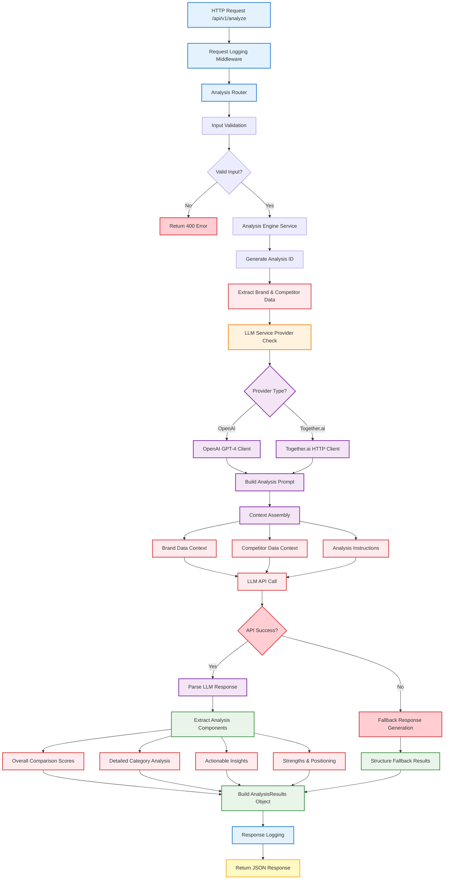

# Analysis Engine Service

A comprehensive brand analysis service with LLM provider toggle support for competitive intelligence and actionable insights.

## 🚀 Features

- **LLM Provider Toggle**: Switch between OpenAI and Together.ai
- **Comprehensive Analysis**: Brand vs competitor analysis with scoring
- **Actionable Insights**: Priority-based recommendations with implementation steps
- **Real-time Status**: Track analysis progress with polling endpoints
- **Trend Analysis**: Market positioning and trend identification
- **Health Monitoring**: Service health and LLM connectivity checks

## 🔧 LLM Provider Configuration

### Supported Providers

1. **OpenAI GPT-4** (Default)
   - High-quality analysis with proven reliability
   - Requires OpenAI API key

2. **Together.ai Llama-3.3-70B** 
   - Cost-effective alternative with excellent performance
   - Requires Together.ai API key

### Switching Providers

Edit the `.env` file to change the LLM provider:

```bash
# For OpenAI (default)
LLM_PROVIDER=openai
OPENAI_API_KEY=your_openai_api_key_here
OPENAI_MODEL=gpt-4

# For Together.ai
LLM_PROVIDER=together
TOGETHER_API_KEY=your_together_api_key_here
TOGETHER_MODEL=meta-llama/Llama-3.3-70B-Instruct-Turbo-Free
```

### Environment Variables

| Variable | Description | Default |
|----------|-------------|---------|
| `LLM_PROVIDER` | Choose `openai` or `together` | `openai` |
| `OPENAI_API_KEY` | OpenAI API key | - |
| `OPENAI_MODEL` | OpenAI model name | `gpt-4` |
| `TOGETHER_API_KEY` | Together.ai API key | - |
| `TOGETHER_MODEL` | Together.ai model name | `meta-llama/Llama-3.3-70B-Instruct-Turbo-Free` |

## 📦 Installation

1. **Navigate to the analysis-engine directory:**
   ```bash
   cd analysis-engine
   ```

2. **Install dependencies:**
   ```bash
   pip install -r requirements.txt
   ```

3. **Configure environment:**
   ```bash
   cp .env.example .env
   # Edit .env with your API keys and preferred LLM provider
   ```

## 🏃‍♂️ Quick Start

### Option 1: Direct Start (Recommended)
```bash
uvicorn app.main:app --reload --host 0.0.0.0 --port 8003
```

### Option 2: Python Module Mode
```bash
python -m uvicorn app.main:app --reload --host 0.0.0.0 --port 8003
```

### Option 3: Production Mode
```bash
uvicorn app.main:app --host 0.0.0.0 --port 8003 --workers 4
```

## 📊 API Endpoints

### Start Analysis
```http
POST /api/v1/analyze
Content-Type: application/json

{
  "brand_data": {
    "brand_id": "oriental_bank_pr",
    "news_sentiment": {"score": 0.75},
    "social_media": {"overall_sentiment": 0.68},
    "glassdoor": {"overall_rating": 3.8},
    "website_analysis": {"user_experience_score": 0.82}
  },
  "competitor_data": {
    "brand_id": "banco_popular",
    "news_sentiment": {"score": 0.82},
    "social_media": {"overall_sentiment": 0.74},
    "glassdoor": {"overall_rating": 4.1},
    "website_analysis": {"user_experience_score": 0.89}
  },
  "area_id": "self_service_portal",
  "analysis_type": "comprehensive"
}
```

### Check Analysis Status
```http
GET /api/v1/analyze/{analysis_id}/status
```

### Get Analysis Results
```http
GET /api/v1/analyze/{analysis_id}/results
```

### Health Check
```http
GET /health
```

## 🧪 Testing & Verification

### Test LLM Connectivity
```bash
# Test OpenAI provider
curl -X POST "http://localhost:8003/api/v1/analyze" \
  -H "Content-Type: application/json" \
  -d '{
    "brand_data": {"brand_id": "test_brand"},
    "competitor_data": {"brand_id": "test_competitor"},
    "area_id": "test_area",
    "analysis_type": "comprehensive"
  }'
```

### Test Health Endpoint
```bash
curl http://localhost:8003/health
```

### Switch Providers and Test
```bash
# 1. Edit .env to change LLM_PROVIDER
# 2. Restart service
# 3. Test with the same curl command above
```

This will verify:
- LLM service initialization and connectivity
- Analysis engine workflow
- Provider switching functionality
- API response format compliance

## 🔧 Configuration Details

### LLM Service Architecture

The `LLMService` class provides a unified interface for both providers:

```python
from app.services.llm_service import LLMService

# Automatically uses the configured provider
llm_service = LLMService()

# Generate completion with either provider
response = await llm_service.generate_completion(messages)
```

### Provider-Specific Features

**OpenAI GPT-4:**
- Excellent reasoning and analysis quality
- Consistent response format
- Reliable API uptime

**Together.ai Llama-3.3-70B:**
- Cost-effective for high-volume usage
- Strong performance on analytical tasks
- Open-source model flexibility

## 📈 Analysis Output Structure

The service returns comprehensive analysis results:

```json
{
  "success": true,
  "data": {
    "analysis_id": "analysis_12345",
    "overall_comparison": {
      "brand_score": 0.76,
      "competitor_score": 0.84,
      "gap": -0.08,
      "brand_ranking": "second"
    },
    "detailed_comparison": {
      "user_experience": {
        "brand_score": 0.82,
        "competitor_score": 0.89,
        "difference": -0.07,
        "insight": "Competitor has superior UI/UX design"
      }
    },
    "actionable_insights": [
      {
        "priority": "high",
        "title": "Implement Advanced Mobile Banking Features",
        "implementation_steps": ["...", "..."],
        "expected_impact": "Increase UX score by 0.15"
      }
    ]
  }
}
```

## 🚀 Production Deployment

1. **Set production environment variables**
2. **Choose appropriate LLM provider based on cost/quality requirements**
3. **Configure logging level** (`LOG_LEVEL=INFO`)
4. **Set up monitoring** for health endpoint
5. **Configure rate limiting** for API endpoints

## 🤝 Integration with Other Services

The Analysis Engine integrates with:
- **Data Collection Service** (port 8002): Raw data input
- **Brand Service** (port 8001): Brand metadata
- **Frontend Service**: Analysis visualization

## 📋 API Contract Compliance

This implementation maintains full compatibility with the expected API contract defined in the Postman collection:
- Identical request/response formats
- Same endpoint paths and methods
- Consistent error handling structure
- Matching data models and validation

## 🔍 Troubleshooting

### Common Issues

1. **LLM API Key Not Working:**
   - Verify API key in `.env` file
   - Check API key permissions and quotas
   - Test connectivity with simple requests

2. **Analysis Fails:**
   - Check input data format matches examples
   - Verify LLM provider is accessible
   - Review service logs for error details

3. **Service Won't Start:**
   - Ensure port 8003 is available
   - Install all required dependencies
   - Check Python version compatibility

### Debug Mode

Enable debug logging and start service:
```bash
# Set environment variable and start
LOG_LEVEL=DEBUG uvicorn app.main:app --reload --host 0.0.0.0 --port 8003
```

### Test API Manually
```bash
# Check service is running
curl http://localhost:8003/health

# Test analysis endpoint
curl -X POST "http://localhost:8003/api/v1/analyze" \
  -H "Content-Type: application/json" \
  -d '{
    "brand_data": {"brand_id": "test_brand", "news_sentiment": {"score": 0.75}},
    "competitor_data": {"brand_id": "test_competitor", "news_sentiment": {"score": 0.82}},
    "area_id": "test_area",
    "analysis_type": "comprehensive"
  }'
```

## 🔄 Analysis Engine Processing Flow

The following diagram illustrates the internal processing logic of the Analysis Engine service:



### 🔧 Key Processing Steps

1. **Request Handling**: HTTP middleware logs all requests and routes to analysis endpoint
2. **Data Validation**: Ensures proper format of brand and competitor data
3. **Provider Selection**: Dynamically chooses between OpenAI or Together.ai based on configuration
4. **Context Building**: Assembles comprehensive prompts with brand data and analysis instructions
5. **LLM Processing**: Makes API calls with robust error handling and SSL bypass for corporate environments
6. **Response Parsing**: Extracts structured analysis components from AI responses
7. **Fallback Logic**: Generates contextual responses when LLM calls fail
8. **Result Structuring**: Builds standardized AnalysisResults with scores and insights
9. **Response Delivery**: Returns JSON with comprehensive logging

### 🎯 Analysis Components Generated

- **Overall Scores**: Brand vs competitor numerical comparisons
- **Category Analysis**: Detailed breakdown by business areas
- **Actionable Insights**: Priority-ranked recommendations with implementation steps
- **Competitive Strengths**: Brand advantages and market positioning analysis

## 📝 License

This service is part of the Brand Identity Revitalization project.
