# 🏢 Enterprise CI/CD Pipeline Guide
## Brand Intelligence Hub - Azure DevOps Implementation

---

## 📋 **Overview**

This guide provides complete instructions for setting up and using the enterprise-grade CI/CD pipeline for the Brand Intelligence Hub. The pipeline addresses the **Azure DevOps parallelism limitation** while implementing best practices for security, quality, and compliance.

### 🎯 **Pipeline Features**

- ✅ **Self-Hosted Agent** (solves parallelism issue)
- ✅ **Multi-Service Docker Builds** (brand-service, data-collection, analysis-engine)
- ✅ **Security Scanning** (source code + containers)
- ✅ **Code Quality Gates** (80% coverage threshold)
- ✅ **Docker Hub Publishing** (public repositories)
- ✅ **Automated Testing** (unit tests + integration)
- ✅ **Compliance Reporting** (ISO27001 aligned)
- ✅ **Build Notifications** (email alerts)

---

## 🚀 **Quick Start (30 minutes)**

### **Step 1: Set Up Self-Hosted Agent**
```bash
# Run the setup script
./scripts/setup-self-hosted-agent.sh

# Follow prompts to enter:
# - ADO Organization URL: https://dev.azure.com/Vibects13
# - Project Name: 118797
# - Personal Access Token (create in ADO)
```

### **Step 2: Configure Pipeline**
```bash
# Copy the new pipeline to replace existing
cp .azure/pipelines/enterprise-ci-cd.yml azure-pipelines.yml

# Commit changes
git add .
git commit -m "Add enterprise CI/CD pipeline"
git push origin master
```

### **Step 3: Set Up Service Connections**
1. Go to **Project Settings** → **Service Connections**
2. Create **Docker Registry** connection:
   - Connection Name: `docker-hub-connection`
   - Registry URL: `https://docker.io`
   - Username: Your Docker Hub username
   - Password: Docker Hub access token

### **Step 4: Run Pipeline**
1. Navigate to **Pipelines** in Azure DevOps
2. Select your pipeline
3. Click **Run Pipeline**
4. Monitor the 5 stages execution

---

## 📁 **Repository Structure**

```
brand-intelligence-hub/
├── .azure/
│   └── pipelines/
│       ├── enterprise-ci-cd.yml          # Main pipeline
│       └── templates/
│           ├── build-service.yml         # Service build template
│           └── security-scan.yml         # Security scanning
├── scripts/
│   └── setup-self-hosted-agent.sh       # Agent setup
├── .dockerignore                         # Build optimization
├── pipeline-config.json                  # Configuration
└── docs/
    └── ENTERPRISE_PIPELINE_GUIDE.md     # This guide
```

---

## 🏗️ **Pipeline Architecture**

### **5-Stage Enterprise Pipeline**

```mermaid
graph TD
    A[🚦 Trigger: Master Branch] --> B[🔍 Stage 1: Code Quality]
    B --> C[🧪 Stage 2: Build & Test]
    C --> D[🔒 Stage 3: Security Scan]
    D --> E[📦 Stage 4: Publish]
    E --> F[📊 Stage 5: Reporting]
```



#### **Stage 1: Code Quality & Security Analysis**
- Python linting (flake8)
- Source code security scan (bandit)
- Secrets detection
- Dependency vulnerability check

#### **Stage 2: Build & Test Services**
- **Parallel Execution** of 3 services:
  - Brand Service (port 8001)
  - Data Collection (port 8002)
  - Analysis Engine (port 8003)
- Unit tests + code coverage
- Docker image builds
- Health check validation

#### **Stage 3: Container Security Scanning**
- Container vulnerability scanning (Trivy)
- Docker configuration security
- Image layer analysis
- Compliance checks

#### **Stage 4: Publish & Archive**
- Docker Hub publishing
- Semantic versioning (v1.0.x)
- Git tag creation
- Build artifacts archiving

#### **Stage 5: Reporting & Notifications**
- Build success/failure reports
- Email notifications
- Metrics collection
- Dashboard updates

---

## ⚙️ **Configuration**

### **Pipeline Variables**

Edit `pipeline-config.json` to customize:

```json
{
  "dockerRegistry": {
    "namespace": "avishekdascool",  // Your Docker Hub username
    "registry": "docker.io"
  },
  "qualityGates": {
    "codeCoverage": {
      "threshold": 80              // Coverage percentage
    }
  },
  "notifications": {
    "email": {
      "recipients": ["Avishek.das4@cognizant.com"]
    }
  }
}
```

### **Service Configuration**

Each service is configured in the JSON:
- **Port mapping**
- **Resource limits**
- **Health check endpoints**
- **Test commands**
- **Build contexts**

---

## 🔐 **Security Features**

### **Multi-Layer Security Scanning**

1. **Source Code Analysis**
   - Python security issues (Bandit)
   - Hardcoded secrets detection
   - Code pattern analysis

2. **Dependency Scanning**
   - Known vulnerability databases
   - License compliance
   - Outdated package detection

3. **Container Security**
   - Base image vulnerabilities
   - Layer-by-layer analysis
   - Configuration best practices

### **Security Gates**
- **Fail Build**: Critical vulnerabilities found
- **Warning**: High severity issues (configurable threshold)
- **Report**: All findings documented and archived

---

## 📊 **Quality Gates**

### **Code Coverage**
- **Threshold**: 80% (configurable)
- **Action**: Warning if below threshold
- **Reporting**: HTML + XML coverage reports
- **Trending**: Track coverage over time

### **Build Quality**
- **Docker Image Size**: Optimized with .dockerignore
- **Build Time**: Parallel execution reduces time
- **Test Results**: JUnit format for trending
- **Artifact Size**: Compressed archives

---

## 🐳 **Docker Hub Integration**

### **Published Images**
After successful builds, images are published to:

- `avishekdascool/brand-service:v1.0.x`
- `avishekdascool/data-collection:v1.0.x`  
- `avishekdascool/analysis-engine:v1.0.x`

### **Tagging Strategy**
- **Latest**: Most recent successful build
- **Version**: Semantic version (v1.0.x)
- **Build**: Build number reference

### **Image Metadata**
Each image includes labels:
```dockerfile
LABEL version="1.0.1"
LABEL service="brand-service"
LABEL build.number="123"
LABEL git.commit="abc123"
```

---

## 📧 **Notifications**

### **Email Notifications**
**Recipient**: Avishek.das4@cognizant.com

**Triggers**:
- ✅ Build Success (optional)
- ❌ Build Failure (always)
- ⚠️ Security Issues Found
- 📊 Quality Gate Failures

**Email Content**:
- Build status and version
- Docker image URLs
- Quality metrics summary
- Direct link to build results

---

## 🔧 **Troubleshooting**

### **Common Issues**

#### **Agent Offline**
```bash
# Check agent status
~/check-ado-agent.sh

# Restart agent service
sudo ~/ado-agent/svc.sh restart
```

#### **Docker Hub Authentication**
```bash
# Test Docker Hub login
docker login docker.io

# Verify service connection in ADO
# Project Settings → Service Connections
```

#### **Build Failures**
1. **Code Coverage Below 80%**
   - Add more unit tests
   - Check test discovery paths
   - Verify pytest configuration

2. **Security Scan Failures**
   - Review security reports
   - Update vulnerable dependencies
   - Fix high/critical issues

3. **Docker Build Failures**
   - Check Dockerfile syntax
   - Verify base image availability
   - Review .dockerignore patterns

---

## 📈 **Monitoring & Metrics**

### **Build Dashboard**
Access via: **Azure DevOps** → **Pipelines** → **Analytics**

**Key Metrics**:
- Build success rate
- Average build time
- Test pass rate
- Coverage trends
- Security issue trends

### **Docker Hub Metrics**
Track via Docker Hub dashboard:
- Image pull counts
- Repository stars
- Vulnerability scan results

---

## 🔄 **Maintenance**

### **Monthly Tasks**
- [ ] Update base Docker images
- [ ] Review security scan results
- [ ] Update pipeline dependencies
- [ ] Check agent disk space
- [ ] Review build performance metrics

### **Quarterly Tasks**
- [ ] Update ADO agent version
- [ ] Review and update quality gates
- [ ] Security tools version updates
- [ ] Pipeline optimization review

---

## 🚀 **Advanced Features**

### **Future Enhancements**

1. **Multi-Environment Support**
   - Dev/Staging/Prod configurations
   - Environment-specific quality gates
   - Progressive deployment

2. **Advanced Security**
   - SAST/DAST integration
   - Container runtime security
   - Compliance automation

3. **Performance Testing**
   - Load testing integration
   - Performance regression detection
   - API contract testing

4. **Observability**
   - OpenTelemetry integration
   - Custom metrics dashboard
   - Alert management

---

## 📚 **Additional Resources**

- [Azure DevOps Documentation](https://docs.microsoft.com/en-us/azure/devops/)
- [Docker Hub Best Practices](https://docs.docker.com/docker-hub/)
- [Security Scanning Tools](https://github.com/analysis-tools-dev/security-analysis)
- [Pipeline as Code](https://docs.microsoft.com/en-us/azure/devops/pipelines/yaml-schema)

---

## 📞 **Support**

**Pipeline Issues**: Check build logs in Azure DevOps  
**Security Questions**: Review security scan reports  
**Configuration Help**: Refer to `pipeline-config.json`  
**Agent Issues**: Run `~/check-ado-agent.sh`

---

## ✅ **Success Checklist**

- [ ] Self-hosted agent online and running
- [ ] Docker Hub service connection configured
- [ ] Pipeline runs successfully end-to-end
- [ ] All 3 Docker images published
- [ ] Email notifications working
- [ ] Security scans passing
- [ ] Code coverage above 80%
- [ ] Build artifacts archived

**🎉 Congratulations! Your enterprise CI/CD pipeline is ready.**

---

*Generated by Brand Intelligence Hub Enterprise Pipeline v1.0.0*  
*Last Updated: $(date)*